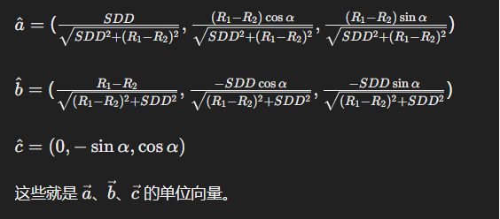
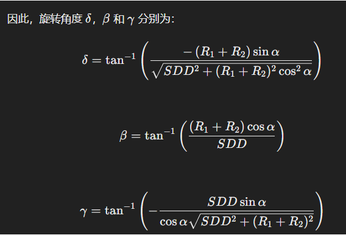

## X轴的方向向量

$$
\vec{a} = \left ( SDD，\left ( R_1-R_2 \right )cos\alpha ,\left ( R_1- R_2 \right ) sin\alpha \right )
$$



$$
单位向量
\vec{x} =\hat{\vec{a}} = \left ( \frac{SDD }{\sqrt{SDD^2+(R_1+R_2)^2}} ，\frac{\left ( R_1+R_2 \right )cos\alpha}{\sqrt{SDD^2+(R_1+R_2)^2}}  ,\frac{\left ( R_1+R_2 \right )sin\alpha}{\sqrt{SDD^2+(R_1+R_2)^2}} \right )
$$


## Y轴方向向量

$$
\vec{b} = \left ( R_1+R_2,-SDDcos\alpha ,-SDDsin\alpha  \right )
$$


单位向量为：

$$
\vec{y} =\hat{\vec{b}}  = \left ( \frac{R_1+R_2}{\sqrt{SDD^2+(R_1+R_2)^2}} ,\frac{-SDDcos\alpha}{\sqrt{SDD^2+(R_1+R_2)^2}}  ,\frac{-SDDsin\alpha}{\sqrt{SDD^2+(R_1+R_2)^2}}  \right )
$$

## Z轴方向向量

$$
\vec{c} =\left ( 0,-sin\alpha ,cos\alpha  \right )
$$

$$
\vec{z} =\hat{\vec{c}} =\left ( 0,-sin\alpha ,cos\alpha  \right )
$$

$$
\alpha = \tan^{-1} \left ( \frac{-n_z}{\sqrt{n_x^2+n_y^2} }  \right ) \beta = \tan^{-1} \left ( \frac{n_y}{n_z}  \right ) \gamma = \tan^{-1} \left ( \frac{o_z}{a_z}  \right ) ，
$$

我们需要从给定矩阵中计算出 \(\alpha\)、\(\beta\) 和 \(\gamma\) 的值。给定的矩阵是：

$$
\begin{bmatrix} n_x & o_x & a_x \\n_y & o_y & a_y \\n_z & o_z & a_z \end{bmatrix}= \begin{bmatrix}  \frac{SDD }{\sqrt{SDD^2+(R_1+R_2)^2}}& \frac{R_1+R_2}{\sqrt{SDD^2+(R_1+R_2)^2}} &0 \\  \frac{\left ( R_1+R_2 \right )cos\alpha}{\sqrt{SDD^2+(R_1+R_2)^2}} & \frac{-SDDcos\alpha}{\sqrt{SDD^2+(R_1+R_2)^2}} & -sin\alpha \\  \frac{\left ( R_1+R_2 \right )sin\alpha}{\sqrt{SDD^2+(R_1+R_2)^2}}& \frac{-SDDsin\alpha}{\sqrt{SDD^2+(R_1+R_2)^2}} &cos\alpha \end{bmatrix}
$$

根据给定的公式：

$$
1.
 \alpha = \tan^{-1} \left( \frac{-n_z}{\sqrt{n_x^2 + n_y^2}} \right)\\
2. \beta = \tan^{-1} \left( \frac{n_y}{n_x} \right)\\
3. \gamma = \tan^{-1} \left( \frac{o_z}{a_z} \right)
$$

> 或者

$$
1. 
\beta = \tan2 \left( -n_z,\sqrt{n_x^2 + n_y^2} \right)\\2. \delta  = \tan2 \left(\frac{n_y}{cos\beta },\frac{n_x}{cos\beta}   \right)\\3. \gamma = \tan2 \left( \frac{o_z}{cos\beta },\frac{a_z}{cos\beta} \right)
$$


### 最终结果

> 图片结果有点问题，以公式为准；

$$
\beta =\tan^{-1} \left ( \frac{-\left ( R_1+R_2 \right )sin\alpha}{\sqrt{SDD^2+(R_1+R_2)^2cos\alpha^2}} \right ) \\
$$

$$
\delta = \tan^{-1} \left ( \frac{\left ( R_1+R_2  \right )cos\alpha }{SDD}  \right ) \\
$$
$$
\gamma = \tan^{-1} \left (-\frac{SDDsin\alpha}{cos\alpha \sqrt{SDD^2+(R_1+R_2)^2}}  \right )
$$

其中 绕Z轴转$\delta $，绕y轴转$\beta$,绕X轴转γ

> **问题**

$$
\begin{bmatrix} n_x & o_x & a_x \\n_y & o_y & a_y \\n_z & o_z & a_z \end{bmatrix}= \begin{bmatrix}  \frac{SDD }{\sqrt{SDD^2+(R_1-R_2)^2}}& \frac{R_1-R_2}{\sqrt{SDD^2+(R_1-R_2)^2}} &0 \\  \frac{\left ( R_1-R_2 \right )cos\alpha}{\sqrt{SDD^2+(R_1-R_2)^2}} & \frac{-SDDcos\alpha}{\sqrt{SDD^2+(R_1-R_2)^2}} & -sin\alpha \\  \frac{\left ( R_1-R_2 \right )sin\alpha}{\sqrt{SDD^2+(R_1-R_2)^2}}& \frac{-SDDsin\alpha}{\sqrt{SDD^2+(R_1-R_2)^2}} &cos\alpha \end{bmatrix}这是位姿矩阵，用公式1. \beta = \tan2 \left( -n_z,\sqrt{n_x^2 + n_y^2} \right)\\2. \delta = \tan2 \left(\frac{n_y}{cos\beta },\frac{n_x}{cos\beta}   \right)\\3. \gamma = \tan2 \left( \frac{o_z}{cos\beta },\frac{a_z}{cos\beta} \right)，求出\alpha,\beta, \gamma 
$$

$$
\begin{bmatrix} n_x & o_x & a_x \\n_y & o_y & a_y \\n_z & o_z & a_z \end{bmatrix}= \begin{bmatrix}  \frac{SDD }{\sqrt{SDD^2+(R_1+R_2)^2}}& \frac{R_1+R_2}{\sqrt{SDD^2+(R_1+R_2)^2}} &0 \\  \frac{\left ( R_1+R_2 \right )cos\alpha}{\sqrt{SDD^2+(R_1+R_2)^2}} & \frac{-SDDcos\alpha}{\sqrt{SDD^2+(R_1+R_2)^2}} & -sin\alpha \\  \frac{\left ( R_1+R_2 \right )sin\alpha}{\sqrt{SDD^2+(R_1+R_2)^2}}& \frac{-SDDsin\alpha}{\sqrt{SDD^2+(R_1+R_2)^2}} &cos\alpha \end{bmatrix}这是位姿矩阵，用公式1. \delta = \tan^{-1} \left( \frac{-n_z}{\sqrt{n_x^2 + n_y^2}} \right)\\
2. \beta = \tan^{-1} \left( \frac{n_y}{n_x} \right)\\
3. \gamma = \tan^{-1} \left( \frac{o_z}{a_z} \right)，求出\delta,\beta, \gamma
$$

